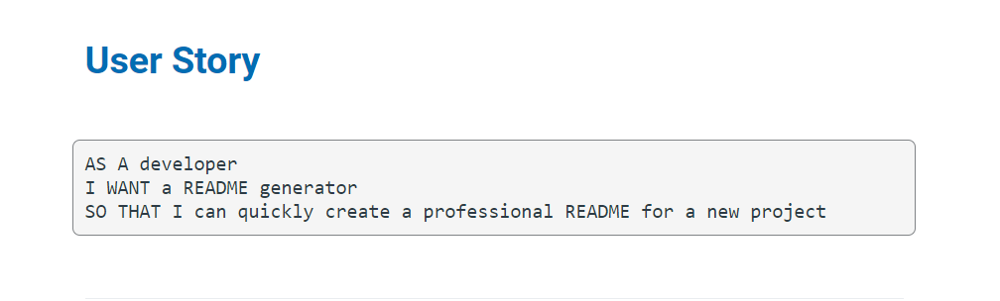
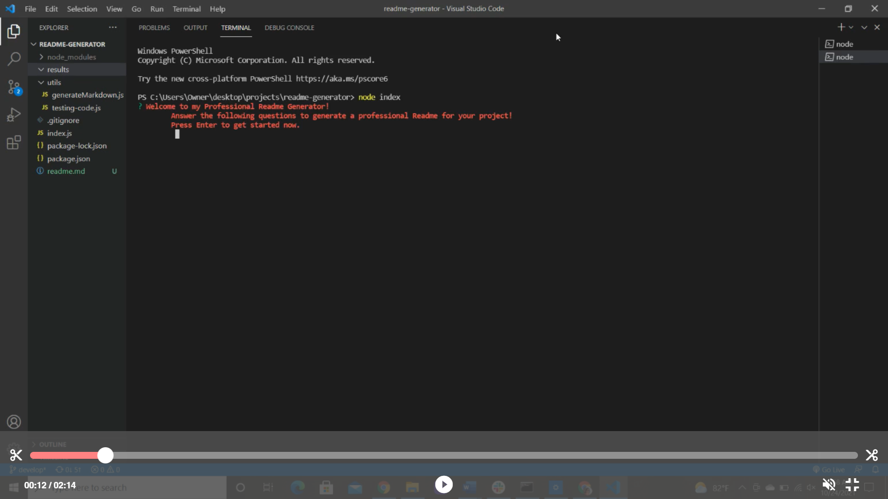
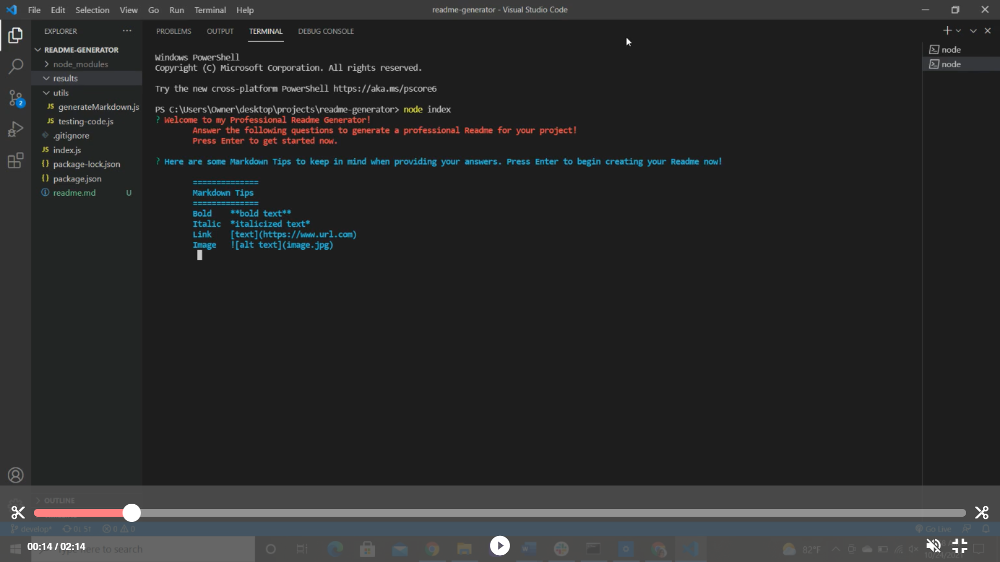
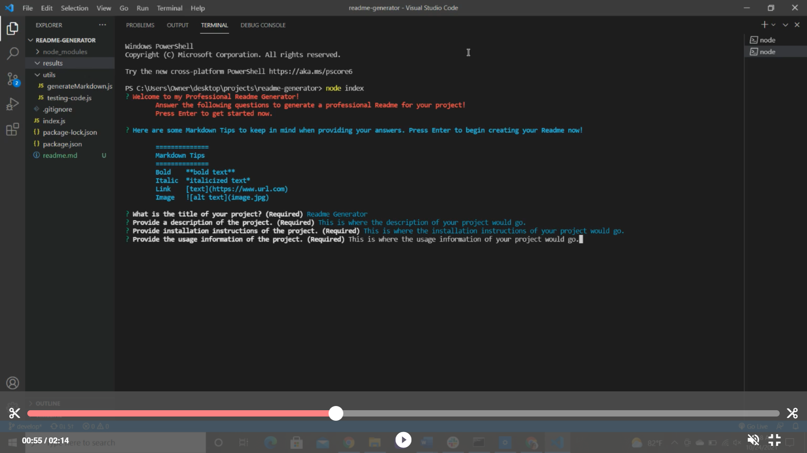
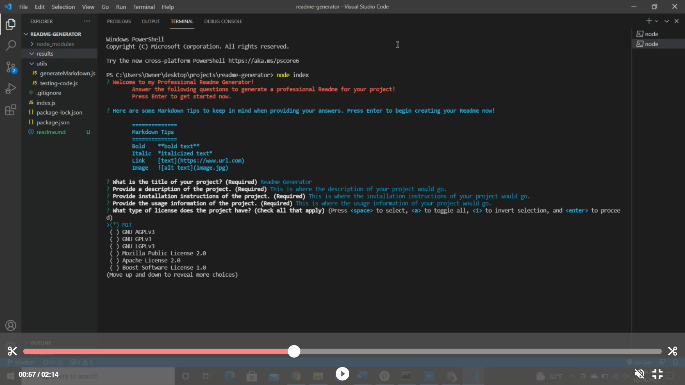
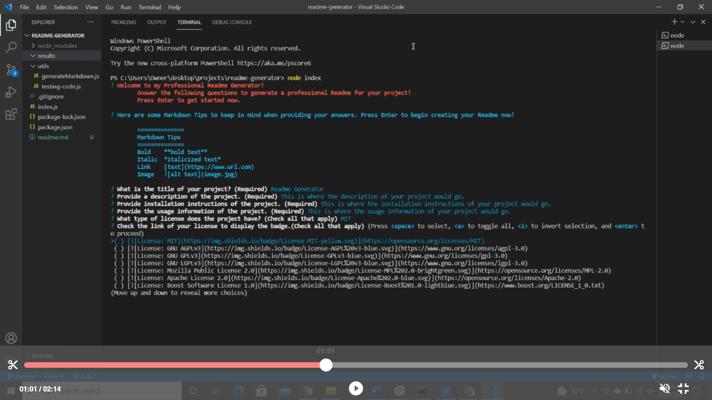
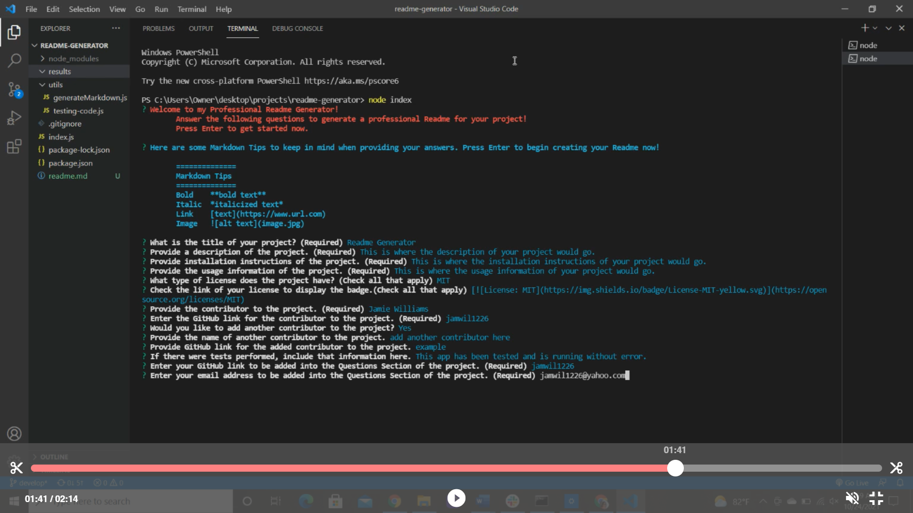
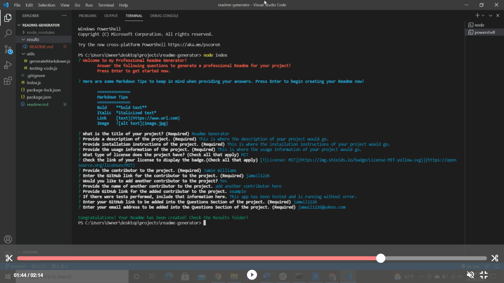
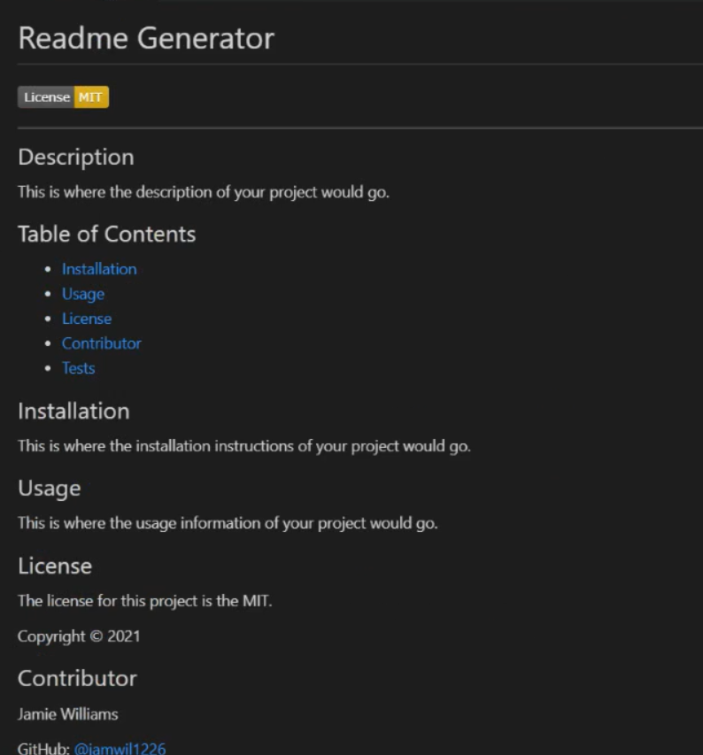

# Welcome to my README GENERATOR!

## Description

#### This README GENERATOR allows the user to quickly and easily generate a professional Readme by using a command-line application and answering questions in the terminal! This allows the user to devote more time on their project and less time on the Readme file.

## Table of Contents
* [Installation](#installation)
* [Usage](#usage)
* [License](#license)
* [Contributor](#contributor)
* [Tests](#tests)

## Installation
In order to run this Readme Generator, you will need to install node.js. 

## Usage
To use this app, clone this repository and run index.js on the command-line to start. You will be greeted with a welcome message indicating the Readme Generator has started.

 After pressing enter to begin, you will be given Mardown Tips to help you style your Readme according to your preference. 
 

 
 Once you review the tips, hit enter to start answering the questions that will generate your Readme. 
 

After a few initial questions, you will be asked to choose the license(s) that you would like to assign to your project.
 

 Once you choose the license(s), you will select the corresponding badge that will print onto your Readme.
 

After selecting the appropriate badge(s), you will be asked additional questions to complete your professional Readme.

When you have answered all of the questions, you will be given a message to indicate that your professional Readme has been generated! Look in the results folder to see it!

Your professional Readme has been generated to include your title, license badge, description, table of contents, installation instructions, usage information, license information, contributor information, test information, and a questions section that includes GitHub link and email address.

## License
The license for this project is the MIT.

Copyright © 2021

## Contributor
Jamie Williams

GitHub: [@jamwil1226](https://github.com/jamwil1226/)

## Addtional Contributors
Additional Contributors welcome! Reach out to me if you are interested!

## Tests
This app has been tested and is running without error.

Watch this demo to see the Readme Generator in action!
https://watch.screencastify.com/v/YhGBIzQ2Z6e92qBEMRkl

## Questions
*If you have any questions, please reach out to me at* 

GitHub: [@jamwil1226](https://github.com/jamwil1226/)

Email: [jamwil1226@yahoo.com](mailto:jamwil1226@yahoo.com)

### I hope you enjoy using this Readme Generator! I welcome all contributions and feedback!

### I look forward to hearing from you!

### _Jamie Williams_ 

